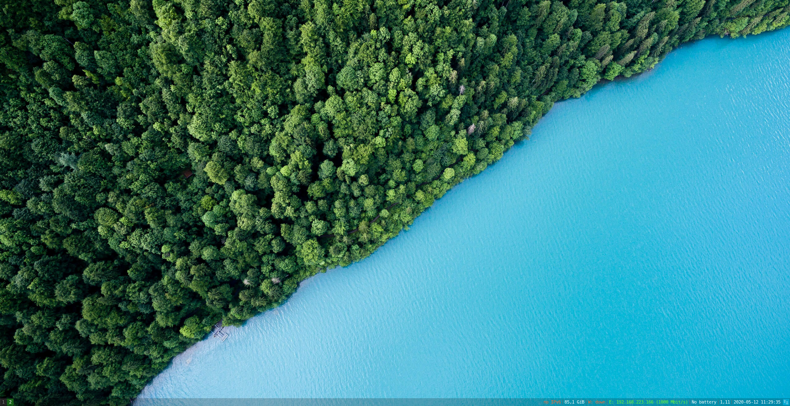
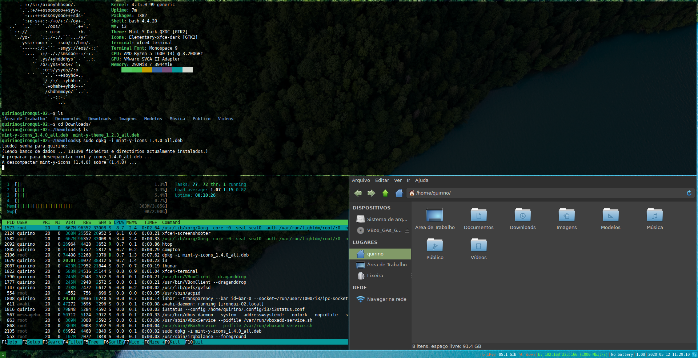

# Qi3DC → Quirino's i3-gapps Default Config

### Why?
We already have so many mods and styles to our desktops, but I usually need to reinstall and reinvent my usability options, so I don't wanna use any of all disponible "refisefuquis"¹, I've most used it on Debian Buster, but should works on Xubuntu and most Debian derivatives with base i3 + XFCE4.

Debian has no i3-gapps, witch make's me sufer everytime I need to install i3. So, i've decided to try some automation and share my options.

### ScreenShots

